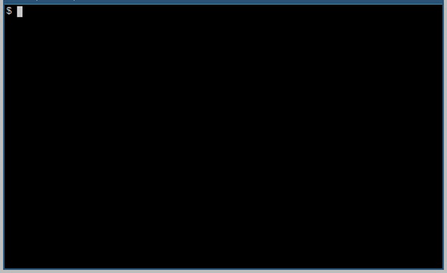

MyCAD
=====



MyCAD is a small passion-project (for now). I like to contribute to
[FreeCAD](https://freecadweb.org), which is a great piece of software with a fantastic
community. However, I often find myself frustrated with the almost 20-year-old code base,
specifically when I find examples of anywhere from poor to downright dangerous coding
practices.

I issue no blame at all on the FreeCAD development team - the project started in the early
2000's, a time when c++ (and many things!) was a much different thing. Also, it is run by
a group of volunteers - we all do our best.

However, in an attempt to satisfy the OCD in me, I'm going to try a "ground up" approach
to what I think a CAD package should/could be.

Doxygen-generated documentation is hosted [here on
gitlab](https://ezzieyguywuf.gitlab.io/mycad)

Project Status
==============

As can be seen in the brief demo at the top of this file, currently, MyCAD doesn't do
much. 🤣

Don't fret though! We're working on it! And by "we" I mean "me". Seriously though, take a
glance at the git commit history - there's a lot of work going on trying to incrementally
improve MyCAD so that it can be...well, My CAD (but when you say it, it will be YOUR CAD.
Get it?).

One of the goals (number 3 below) is to be disciplined in our approach to growing the code
base. As part of that, I'm trying out some of these fancy "Agile" principles, namely, I'm
maintaining a list of "Stories" (see [Stories.md](Stories.md)) which each represent a
specific feature that a specific User will be interested in.

Importantly, it is generally not OK for a Story to have "A developer" as the User (you'll
notice I've been very careful not to do that).

Hopefully, this approach will mean that development will focus mostly on outward facing
features that you care about - i.e., our demo gif should get neater and neater!

Periodically, though, we'll go back and refactor or rethink parts of the code base, in
order to make it more manageable to bring you new features.

For example: recently, I went in and implemented a `Command` class. Nobody really cares!
It was not associated with a Story! But, I did it because there ARE Stories that request
new commands that MyCAD understands, and I believe that by taking the time now to
implement a `Command` class, I can ultimately deliver new commands to the User quicker!

I'm just learning here! See number 1 below!

Goals
=====

In general, I have some very concrete goals for this project:

1. Learn - I am not a trained programmer. I've learned what I know on the internet.
   Therefore, one of the first goals is to simply advance my knowledge of coding practices
   and paradigms.
2. Have Fun - I mean, come on: if you're not having fun, what are you doing?!
3. Be Disciplined - I want to be sure that whatever code is pushed to the master branch is
   solid, robust, and maintainable. I think the best way to accomplish this is with
   discipline, whether via coding practices, testing techniques, etc.
4. Document - my favourite libraries to use are those that are documented well. Therefore
   I want to provide that same opportunity to potential users of MyCAD.

How To Build
============
**TODO**: Make this section more better.

MyCAD has a few dependencies. Please install these on your system using whatever means you
usually employ:

- a c++ compiler
- cmake
- qt5-base (we need the headers, so something like `apt get install qt5-base-devel` in
  ubuntu or something)
- These are acually dependencies of [CGAL](https://www.cgal.org/). We include the CGAL
  headers directly (check the src directory) but you'll need to provide your own versions
  of these
  - [boost](https://www.boost.org/)
  - [gmp](https://gmplib.org/manual/C_002b_002b-Interface-General.html)
  - [mpfr](https://www.mpfr.org/)
- git (duh)

Optionally, you can install doxygen if you want to build the documentation, but it is
already hosted [here on gitlab](https://ezzieyguywuf.gitlab.io/mycad) for your viewing pleasure.

Once all that is out of the way, you can build as follows:

```sh
git clone https://gitlab.com/ezzieyguywuf/mycad
cd mycad
mkdir build
cmake ..
make
```

That's all it takes! Now, mind you, this project is still very much a work in progress,
but check it `./bin/MyCAD_Tests` as well as the test definitions in the `test`
sub-directory to get an idea of how things work and go together.

Credits
=======

This project makes used of the following open-source projects (thank you!)

- [Catch2](https://github.com/catchorg/Catch2)
- [cxxopts](https://github.com/jarro2783/cxxopts)
- [CGAL](https://www.cgal.org/)
- [gitlab](https://gitlab.com)
- [doxygen](http://www.doxygen.nl/)

The project was developed using the following, also open-source projects (THANK YOU!)
- [gentoo](https://www.gentoo.org/)
- [neovim](https://neovim.io/)
- [firefox](https://www.mozilla.org/en-US/firefox/new/)[^1]
- [st](https://st.suckless.org/) (the humble terminal)
- [tmux](https://github.com/tmux/tmux) (makes the terminal sligthly cocky)
- [gdb](https://www.gnu.org/software/gdb/)
- [clang](https://clang.llvm.org/)
- [cmake](https://cmake.org/)
- [gcc](https://gcc.gnu.org/)

This project has also drawn influence and inspiration from:

- [FreeCAD](https://www.freecadweb.org/)
- [Blender](https://www.blender.org/)

[^1]: Let's be honest - how much do we take browsers for granted? I mean, I learned
  everything I know about programming on the internet. That's not a hyperbole. Literally
  everything (ok, fine, I took ONE FORTRAN class in college. And no, I'm not that old,
  just our curriculum was...). \
\
  Without the internet, and the dedicated and wonderful communities that exist to share
  and propogate information, this project would not exist - at least not coming from me.
  So THANK YOU!
